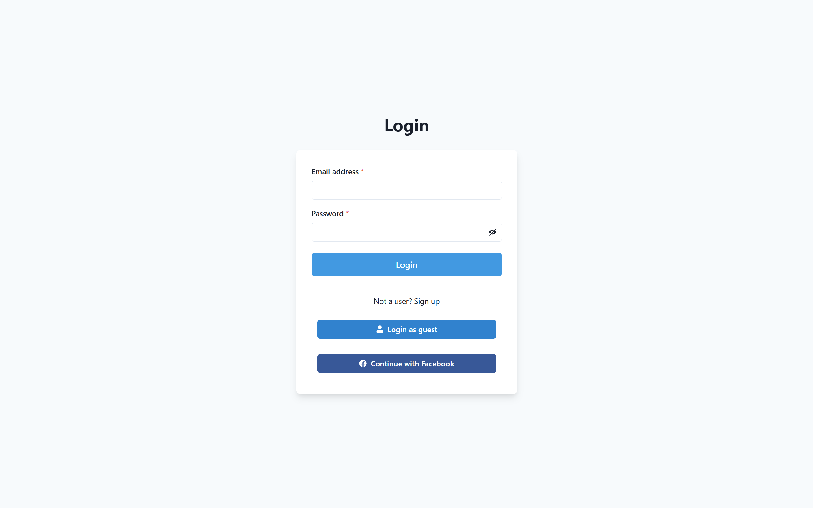
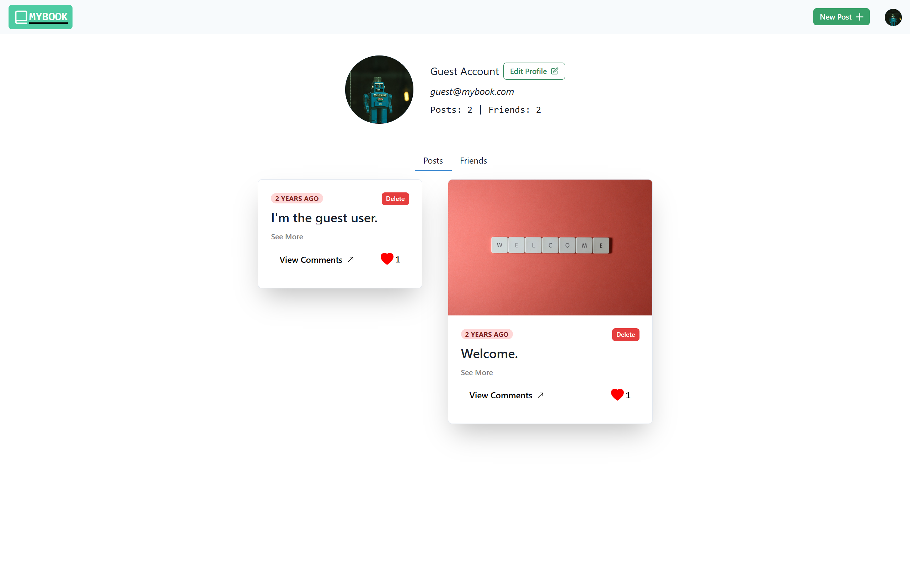
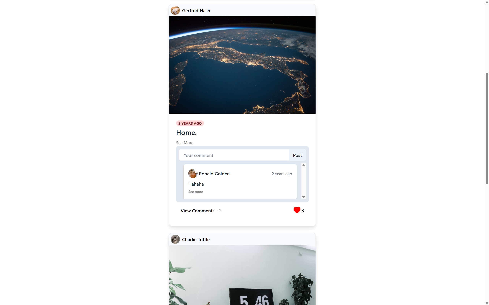
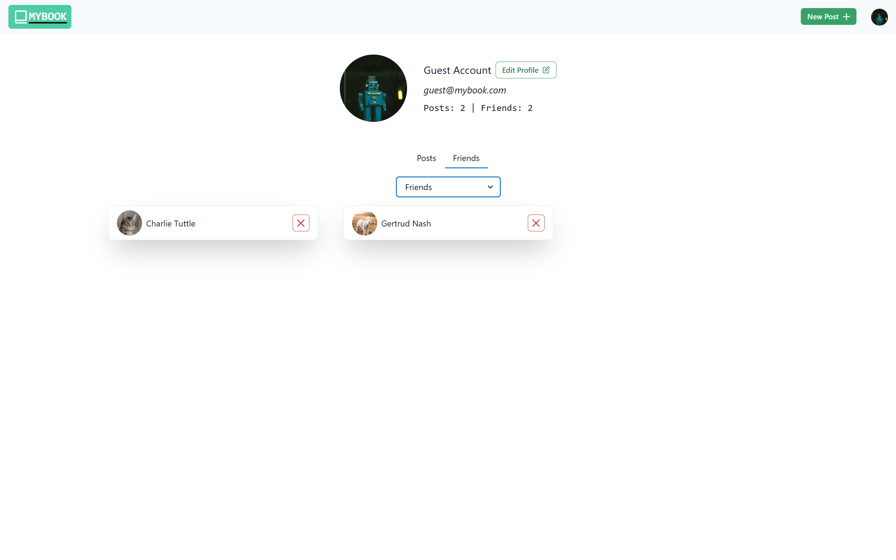

# MyBook - A Facebook Clone

MyBook is a full-stack web application that replicates the core functionality of Facebook. Users can sign in using their Facebook credentials, send friend requests, create posts, like posts, comment on posts, upload profile photos, and more. This project is built using JavaScript, Node.js, Express.js, MongoDB with Mongoose, and React.js with Chakra UI.

### Live Preview: [https://mybook-mocha.vercel.app](https://mybook-mocha.vercel.app) or [https://rif-7.github.io/mybook](https://rif-7.github.io/mybook) 
The site may fail or take a while to connect to the backend server initially since it is hosted on a free plan.
    

## Table of Contents
- [Screenshots] (#screenshots)
- [Introduction](#introduction)
- [Features](#features)
- [Getting Started](#getting-started)
  - [Prerequisites](#prerequisites)
  - [Installation](#installation)
- [Usage](#usage)
- [Project Structure](#project-structure)
- [Technologies Used](#technologies-used)
- [License](#license)


## Screenshots

### Login Page


### Profile Page


### Home Page


### Friends List



## Introduction

MyBook is a project inspired by Facebook, designed to provide a high-level user experience similar to the real Facebook platform. It allows users to create accounts, connect with friends, share posts, and interact with each other just like they would on Facebook.

## Features

- **User Authentication:** Users must sign in to access the platform, and they can use their real Facebook credentials for a seamless login experience.
  
- **Guest Sign-In:** A guest sign-in functionality allows visitors to explore the platform without creating an account or providing credentials.

- **Friend Requests:** Users can send and accept friend requests, enabling them to connect with other users.

- **Post Creation:** Users can create text-based and image posts to share their thoughts and experiences with their friends.

- **Likes and Comments:** Users can like and comment on posts to interact with the content.

- **Homepage:** The homepage displays recent posts from the users friends, mimicking Facebook's "Timeline" feature.

- **Profile Creation:** Users can create profiles, complete with profile photos, to personalize their accounts.

- **Profile Photo Updates:** Users can upload and update their profile photos as they see fit.

## Getting Started

### Prerequisites

Before running the MyBook application, make sure you have the following:

- [Node.js](https://nodejs.org/)

### Installation

1. Clone the repository:

   ```bash
   git clone https://github.com/rif-7/mybook.git
   ```

2. Install dependencies for both the client and server:

   ```bash
   cd mybook
   cd client
   npm install
   cd ../server
   npm install
   ```

3. Configure environment variables:

   Create a `.env` file in the `server` directory and configure the following variables:

   - `FACEBOOK_APP_ID`: Your Facebook App ID (for authentication).
   - `SESSION_SECRET`: A secret key for session management.
   - `MONGO_PASSWORD`: Your MongoDB Atlas password.
   - `MONGO_USERNAME`: Your MongoDB Atlas username.
   - `JWT_SECRET`: A secret key for JWT token generation.
   - `CLOUDINARY_CLOUD_NAME`: Your Cloudinary cloud name (for image hosting).
   - `CLOUDINARY_API_KEY`: Your Cloudinary API key.
   - `CLOUDINARY_API_SECRET`: Your Cloudinary API secret.
   - `CLIENT_HOST`: The URL of your client application (e.g., http://localhost:3000).
   - `SERVER_HOST`: The URL of your server (e.g., http://localhost:5000).
   - `GUEST_EMAIL`: Email for guest sign-in.
   - `GUEST_PASSWORD`: Password for guest sign-in.

  Update the apiUrl variable in the `client/src/api.js` file to your hosted server.

4. Start the server:

   ```bash
   cd server
   npm start
   ```

5. Start the client:

   ```bash
   cd client
   npm start
   ```

## Usage

1. Sign in using your credentials or use the guest sign-in functionality.
2. Explore the platform, send friend requests, create posts, like and comment on posts, and update your profile.

## Project Structure

The project is organized into two main folders:

- `client/`: Contains the React.js frontend of the application.
- `server/`: Contains the Node.js backend, including the API routes and database models.

## Technologies Used

- JavaScript
- Node.js
- Express.js
- MongoDB with Mongoose
- Passport.js (for authentication)
- React.js
- Chakra UI
- React Router
- Cloudinary (for image hosting)
